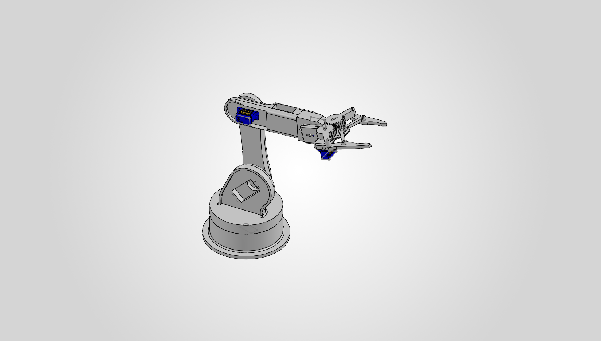

# Desktop 5-DOF Robotic Arm

A low-cost, five-degree-of-freedom desktop robotic arm that simulates real-world manufacturing tasks such as picking up, moving, and placing small parts. Built as a hands-on, affordable platform for learning mechatronics, robotics, and automation.

This is an open-source project released under the MIT License.

## Status
Mechanical design complete in SolidWorks. Prototype build and controller code in progress.

## Features
- 5 degrees of freedom, driven by 5 servo motors
- Gripper end effector for picking up small, lightweight items
- Manual mode: potentiometers control each joint directly
- Automatic mode: pre-loaded action sequences for pick-and-place demos
- Target payload of about 20 g (small items such as chips or light foam blocks)

## Repository contents
- [CAD / STEP file](cad/robot_arm_assembly.STEP) - SolidWorks and STEP files for the arm and gripper
- [Arm render](docs/robotarm_render.PNG) - render of the arm
- [BOM](docs/BOM.pdf) - bill of materials with costs and links
- `LICENSE` - MIT license
<!-- - `electronics/` - wiring diagram -->
<!-- - `code/` - controller code -->

## Hardware
- Controller: Arduino Nano
- Servos: MG90S 9g x 4 and SG90 9g x 1
- Power: 5V
- Structure: 3D printed in PLA

## How it works
1. In manual mode, each potentiometer sets the angle of one joint.
2. A switch changes to automatic mode, where the arm runs a stored sequence of positions (for example, pick a part from point A and place it at point B).

## Build it yourself
1. Print the parts from the CAD file in the `cad/` folder.
2. Wire the electronics (wiring diagram coming soon).
3. Upload the controller code (coming soon).
4. Assemble and calibrate each joint.

## License
MIT License. This covers the code and the hardware design files (see `LICENSE`).

## Author
Jason Duong - Mechatronic Systems Engineering, Western University
